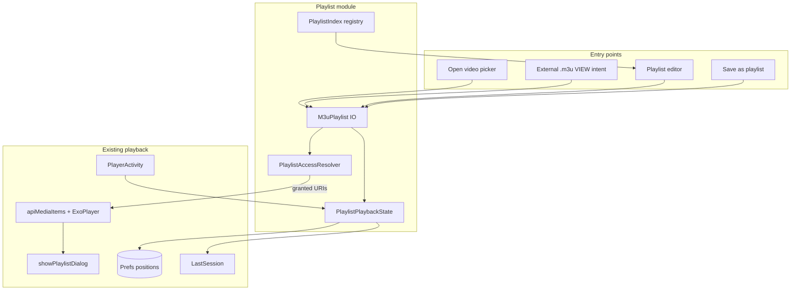

# Playlist support — design specification

Status: **approved decisions** (2026-08-30). Implementation blocked until user says **GO**.

## Summary

Add first-class **M3U playlist file** support to Just+ Player:

- Open `.m3u` playlists through the same file picker as video (plus external intent handler).
- Play as an ExoPlayer queue with per-item resume, access prompts batched by parent folder.
- Persist last index per playlist file; per-item timestamps via existing per-URI position store.
- New main-menu **Playlist editor** activity (phone/tablet v1) for create/delete/edit/rename/copy/reorder/bulk-add.
- Reuse in-player playlist side panel; show playlist display name.
- **Save as playlist** from active queue.

Out of scope v1: Watch Together over file playlists, TV editor UI, external file change detection while playing.

---

## Decisions log

| ID | Topic | Choice |
|----|-------|--------|
| 1.1 | Format | M3U only |
| 1.2 | M3U variant | Extended (`#EXTM3U`, `#EXTINF`) read **and** write |
| 1.3 | Extension | `.m3u` only |
| 1.4 | Item URI types | Anything the player already plays (local SAF/file, HTTP/HTTPS, HLS URLs, etc.) |
| 1.5 | Relative paths | Both absolute and relative; **prefer relative** when resolvable from playlist location |
| 2.1 | Created playlist storage | App-private directory (`Context.getFilesDir()/playlists/`) |
| 2.2 | Editor discovery | Registry index **plus** scan of scoped folder (`scopeUri`) when set |
| 2.3 | External open | Register `ACTION_VIEW` handler for `.m3u` on `PlayerActivity` |
| 3.1 | Open UI | Extend existing Open video picker MIME types; detect playlist after pick |
| 3.2 | Access prompts | **Priority:** (1) batch by parent directory via `OPEN_DOCUMENT_TREE` or multi-doc where possible, (2) per-file `OPEN_DOCUMENT` when batching impossible |
| 3.3 | Partial access | Play accessible items; toast + optional summary of skipped entries |
| 3.4 | Folder auto-next | Unchanged — still applies when opening a **single** video in a folder, not when opening a playlist file |
| 3.5 | LAMPA/API playlist | Independent; `apiAccess` sessions unaffected |
| 4.1 | Resume key | Playlist file URI → current index |
| 4.2 | Persist timing | On index change + periodic tick (same cadence as `LastSession`) |
| 4.3 | Position storage | Index in dedicated playlist state; **timestamps in existing** `Prefs` per-URI `positions` map |
| 4.4 | Last playlist | Remember last-played playlist URI + index across restarts |
| 5.1 | Editor shell | Full-screen `PlaylistEditorActivity` |
| 5.2 | Editor list | Show all playlists; badge when some items lack access |
| 5.3 | Create | Empty playlist after name prompt |
| 5.4 | Delete | Delete playlist file only (with confirm) |
| 5.5 | Rename | Filename **and** optional display title (`#EXTINF` / `#PLAYLIST:` comment) |
| 5.6 | Copy | Save-as to user-picked location |
| 5.7 | Reorder | Drag handles (touch); D-pad move on focusable rows |
| 5.8 | Bulk add | Pick folder → add all videos in folder (alphabetical, same order as folder playlist) |
| 5.9 | Item edit | Remove + reorder only (no inline title/URI edit) |
| 5.10 | Main menu | New pill between **Open link** and **Join room** |
| 5.11 | TV | Editor phone/tablet only v1; TV can still **open/play** playlists |
| 6.1 | Player panel | Reuse `showPlaylistDialog()`; header shows playlist display name |
| 6.2 | Save queue | **Save as playlist** from player when queue has >1 item |
| 7.1 | External edits | Ignore until playlist re-opened |
| 7.2 | Size limit | Soft warning at **500** items (allow continue) |
| 7.3 | Watch Together | Out of scope v1 |

---

## Architecture overview



### New package

`com.brouken.player.playlist`

| Class | Responsibility |
|-------|----------------|
| `M3uPlaylist` | In-memory model: display title, ordered `M3uEntry` list |
| `M3uEntry` | `uri`, `title`, `durationSec` (-1 if unknown) |
| `M3uReader` | Parse extended M3U from `InputStream` / URI |
| `M3uWriter` | Serialize extended M3U to app-private or SAF output stream |
| `M3uUriResolver` | Resolve relative → absolute using playlist base URI |
| `PlaylistAccessResolver` | Check readability; group missing items by parent; run SAF prompts |
| `PlaylistIndex` | Registry of known playlist URIs + metadata (name, item count, access status) |
| `PlaylistPlaybackState` | Per-playlist-file index persistence (`playlist_state` file) |
| `PlaylistEditorActivity` | CRUD UI |

### New flags on `PlayerActivity`

```java
boolean filePlaylist;           // true when queue sourced from .m3u file
Uri filePlaylistUri;            // the .m3u document URI (or file:// in legacy mode)
String filePlaylistTitle;       // display name for panel header
```

Distinct from existing `folderPlaylist` and `apiAccess`. Only one queue source active:

| Source | Flag(s) | When |
|--------|---------|------|
| LAMPA/API | `apiAccess` | Intent extras `video_list` |
| Folder siblings | `folderPlaylist` | Single video open + directory listing |
| M3U file | `filePlaylist` | `.m3u` opened or saved queue |

`resetApiAccess()` extended to clear `filePlaylist*` fields (or dedicated `resetFilePlaylist()` called from same places).

---

## M3U file format

### Read

- Require or accept `#EXTM3U` header (treat missing header as simple M3U for compatibility).
- Parse `#EXTINF:<duration>,<title>` followed by URI line.
- Skip blank lines and `#` comments except recognized tags.
- Optional display title from first `#PLAYLIST:<name>` comment (app-specific; ignored by other players).
- URI forms:
  - `http://`, `https://` — use as-is
  - `content://`, `file://` — use as-is
  - Relative path — resolve against playlist file parent (see below)

### Write

Always emit:

```
#EXTM3U
#PLAYLIST:My Show Season 1
#EXTINF:-1,Episode Title
content://...
```

- `#EXTINF` duration: `-1` when unknown (standard convention).
- Title from `M3uEntry.title` or filename fallback.
- **Relative paths preferred:** when entry URI shares parent with playlist file (same document tree), write relative path; else write absolute URI string.
- UTF-8 encoding; LF line endings.

### Disambiguation vs HLS

- Extension `.m3u` only for playlist files (not `.m3u8`).
- On open: if picked URI ends with `.m3u` **or** MIME is `audio/x-mpegurl` / `application/x-mpegurl` / `application/vnd.apple.mpegurl`, read first bytes — if `#EXTM3U` and subsequent lines look like playlist entries (not `#EXT-X-` tags), treat as file playlist; if `#EXT-X-VERSION` present, treat as HLS stream (existing path).

---

## URI resolution

`M3uUriResolver.resolve(basePlaylistUri, entryPath)`:

1. If entry is already absolute network or document URI → return as-is.
2. If `basePlaylistUri` is `content://` (SAF single file):
   - Derive parent document via `DocumentsContract` / `DocumentFile.getParentFile()`.
   - Resolve sibling by display name or relative path segments.
3. If `basePlaylistUri` is `file://` (legacy/TV): `new File(parent, relativePath).toURI()`.
4. If parent unknown: keep relative string; access check will fail → skipped item after prompts.

---

## Opening a playlist (playback flow)

### Picker changes (`PlayerActivity.openFile`)

Extend `EXTRA_MIME_TYPES` on SAF intent:

```java
"audio/x-mpegurl",
"application/x-mpegurl",
"application/vnd.apple.mpegurl"
```

Keep `video/*` as primary type. MediaStore / legacy chooser: filter or post-filter by `.m3u` extension.

### `onActivityResult` / intent handling

After URI selected:

```
if (isPlaylistFile(uri, mimeType)) {
    openPlaylistFile(uri);
} else {
  // existing video path
}
```

### `openPlaylistFile(Uri playlistUri)`

1. Parse with `M3uReader`.
2. If `entries.size() > 500` → show warning dialog; continue on confirm.
3. `PlaylistAccessResolver.ensureAccess(activity, entries, playlistUri)`:
   - For each entry, probe read access (`ContentResolver.openInputStream` or network HEAD/GET as appropriate).
   - Bucket missing **local** entries by parent directory URI (document tree root or direct parent).
   - For each bucket (fewest prompts):
     - Try `ACTION_OPEN_DOCUMENT_TREE` on common ancestor if multiple siblings missing.
     - Else `ACTION_OPEN_DOCUMENT` with `EXTRA_ALLOW_MULTIPLE` for that folder's files.
   - Re-resolve relative URIs after grants.
4. Build `apiMediaItems` from accessible entries only; set `filePlaylist=true`, `filePlaylistUri`, title.
5. Load index from `PlaylistPlaybackState.getIndex(playlistUri)`; clamp to queue size.
6. For start item, position = `Prefs.getPosition(itemUri)` (existing store).
7. Skipped entries: collect titles/URIs → `Toast` + optional `AlertDialog` list (if >3 skipped, dialog; else long toast).
8. `initializePlayer()` even if zero accessible (show error empty state).

### External intent

`AndroidManifest.xml` — add to existing `PlayerActivity` `ACTION_VIEW` filter:

```xml
<data android:pathPattern=".*\\.m3u" />
<!-- + case variants per existing manifest style -->
<data android:mimeType="audio/x-mpegurl" />
<data android:mimeType="application/x-mpegurl" />
```

`handleViewIntent`: if playlist file, route to `openPlaylistFile` instead of single-media path.

---

## Persistence

### Per-playlist index — `playlist_state`

Private file `playlist_state` (JSON), managed by `PlaylistPlaybackState`:

```json
{
  "lastPlaylistUri": "content://...",
  "playlists": {
    "content://...playlist.m3u": {
      "index": 3,
      "updatedAt": 1730000000000
    }
  }
}
```

- Key = playlist file URI string (stable document id where possible).
- Updated on: `Player.Listener.onMediaItemTransition`, periodic save tick (share `LastSession` scheduler).
- `lastPlaylistUri` + `index` for cold-start resume (decision 4.4).

### Per-item timestamps

**No duplicate store.** Use existing `Prefs.positions` keyed by media item URI string. On playlist item change, `Prefs.updatePosition` as today. Starting item reads `Prefs.getPosition(uri)`.

### `LastSession` extension

Add fields:

```java
boolean filePlaylist;
String filePlaylistUri;
String filePlaylistTitle;
// items[] already carries queue; episodePositions optional — prefer Prefs for file playlists
```

On restore: if `filePlaylist`, reload M3U from URI (ignore external edits per 7.1 = use parsed-at-open snapshot in session items, not re-read disk). Session `items` list is authoritative until user re-opens playlist file.

### Interaction with folder/API modes

- Opening `.m3u` calls `resetApiAccess()` then sets `filePlaylist` (clears `apiAccess`, `folderPlaylist`).
- Opening single video still runs `buildFolderPlaylistIfPossible()` — decision 3.4.
- API intent clears `filePlaylist` via existing `resetApiAccess()`.

---

## Playlist editor

### Activity: `PlaylistEditorActivity`

- Launched from `EmptyState` new pill and from player **Save as playlist** (pre-filled queue).
- **Hidden on TV** (`PlayerActivity.isTvBox`): button `View.GONE` on main menu; no leanback entry. TV users open playlists via Open video / external intent only.

### Main screen sections

1. **Toolbar**: title "Playlists", action **New playlist**.
2. **List**: all playlists from `PlaylistIndex.loadAll()`:
   - App-private `files/playlists/*.m3u`
   - Registry entries for user-opened external playlists
   - Scoped folder scan (`SubtitleUtils` / `DocumentFile` walk for `*.m3u`) when `scopeUri` set
3. **Row**: display title, path hint, item count, access badge (full / partial / none).
4. **Row tap** → edit screen. **Long-press / overflow**: rename, copy, delete.

### Edit screen

- Title field (maps to `#PLAYLIST:` + default filename).
- Ordered `RecyclerView` with drag handle (`ItemTouchHelper`).
- Row: title, URI snippet, remove button.
- FAB / buttons: **Add from folder** (bulk), **Play** (hand off to `PlayerActivity.openPlaylistFile`).
- Save writes via `M3uWriter` to app-private URI or existing file URI.
- Delete: confirm → delete file + registry entry.

### Create flow

1. Prompt playlist name → default filename `sanitize(name).m3u`.
2. Create empty `M3uPlaylist` in app-private dir.
3. Open edit screen.

### Rename (5.5)

- Dialog: filename + optional display title.
- If SAF-backed external file: use `DocumentsContract.renameDocument` when available; else copy-delete pattern.

### Copy (5.6)

- `ACTION_CREATE_DOCUMENT` save-as → write M3U to chosen location → register in index.

### Bulk add from folder (5.8)

- `ACTION_OPEN_DOCUMENT_TREE` or reuse `scopeUri` if covers target.
- `SubtitleUtils.listVideosInDirectory(dir)` — same ordering as folder playlist.
- Append entries; warn if total > 500.

### Access badge (5.2)

- **Full**: all entries readable.
- **Partial**: ≥1 readable, ≥1 not.
- **None**: zero readable (still editable).

---

## Player UI integration

### Playlist side panel (`showPlaylistDialog`)

- When `filePlaylist`: header `getString(R.string.playlist) + " — " + filePlaylistTitle`.
- Same row UI, posters optional (no poster in M3U v1 unless we add `#EXTVLCOPT:` later — **not in v1**).
- Resume hint per row from `Prefs.getPosition(uri)` as API playlist already does.

### Save as playlist (6.2)

- Visible in playlist panel overflow or More menu when `apiMediaItems.size() > 1` and not `apiAccess`.
- Builds `M3uPlaylist` from current queue (folder or file playlist).
- Opens `PlaylistEditorActivity` in save mode or direct save + toast.

### `buttonPlaylist` visibility

Unchanged rule: show when queue size > 1 (includes file playlist).

---

## `PlaylistIndex` registry

`SharedPreferences` or small JSON file `playlist_index`:

```json
{
  "entries": [
    {
      "uri": "content://...",
      "title": "My Playlist",
      "source": "app_private|external|scoped_scan",
      "lastOpened": 1730000000000
    }
  ]
}
```

- Register on: create, open, save-as, copy.
- Prune when file missing on load (unregister stale).
- Deduplicate by URI string (`Prefs.isSameDocument` where applicable).

---

## Access resolution detail

`PlaylistAccessResolver` algorithm:

```
missing = entries where !canRead(uri)
groups = groupByParentDirectory(missing)
for (group in groups sorted by size desc):
  if (group.size > 1 && commonTreeGrantPossible(group)):
    prompt OPEN_DOCUMENT_TREE on ancestor
    map granted tree → re-resolve siblings
  else:
    prompt OPEN_DOCUMENT with EXTRA_ALLOW_MULTIPLE for files in group
    takePersistableUriPermission each
return updated entries + skipped list
```

`canRead`:

- `content://`: `openInputStream` succeeds or persisted grant exists.
- `file://`: `File.canRead()`.
- `http(s)`: assume readable (player will fail at playback); optional lightweight range request — **skip preflight for network** in v1 to avoid delay.

---

## Strings (new)

Add to `values/strings.xml` (translate later via Weblate):

- `playlist_editor` — "Playlist editor"
- `playlist_new` — "New playlist"
- `playlist_empty` — "No playlists yet"
- `playlist_access_full` / `_partial` / `_none`
- `playlist_skipped_items` — "Skipped %d unavailable items"
- `playlist_size_warning` — "This playlist has %d items (recommended max 500). Continue?"
- `playlist_save_as` — "Save as playlist"
- `playlist_add_from_folder` — "Add from folder"
- `playlist_delete_confirm` — "Delete playlist \"%s\"?"
- `playlist_name_prompt` — "Playlist name"
- `empty_state_playlists` — label for main menu pill

---

## Testing plan (for implementation phase)

| Area | Tests |
|------|-------|
| `M3uReader` / `M3uWriter` | Round-trip extended M3U; relative/absolute paths; UTF-8 titles |
| `M3uUriResolver` | content:// and file:// bases |
| `PlaylistPlaybackState` | JSON round-trip; index clamping |
| `PlaylistAccessResolver` | Grouping logic (unit test with mocked URIs) |
| `LastSession` | Extended fields serialize |
| Instrumented | Open `.m3u` from test assets; editor create + play smoke |

---

## Risks and mitigations

| Risk | Mitigation |
|------|------------|
| SAF parent resolution fails for some providers | Fall back to per-file picker; mark partial access |
| App-private playlists not visible in file managers | By design (2.1); copy/save-as exports |
| `apiMediaItems` name overload | Clear flags; document three queue sources |
| Large playlist UI jank | `RecyclerView` everywhere; lazy load in editor |
| M3U vs HLS mis-detect | Content sniff for `#EXT-X-` vs `#EXTINF` |

---

## Related files (existing)

| File | Role |
|------|------|
| `PlayerActivity.java` | Open flow, queue, panel, session save |
| `Prefs.java` | Per-URI positions, `LastSession` |
| `LastSession.java` | Process-death snapshot |
| `EmptyState.java` | Main menu |
| `SubtitleUtils.java` | Directory video listing |
| `Utils.java` | MIME types, chooser helpers |
| `activity_player.xml` | Empty state layout |

See `docs/playlist-support-implementation.md` for phased file-level work breakdown.
